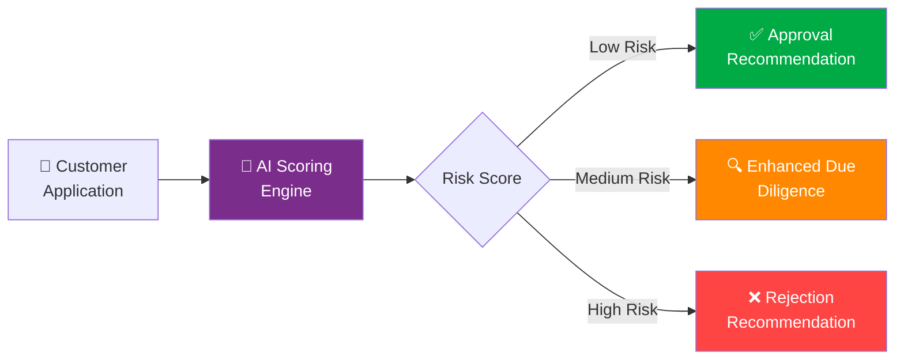
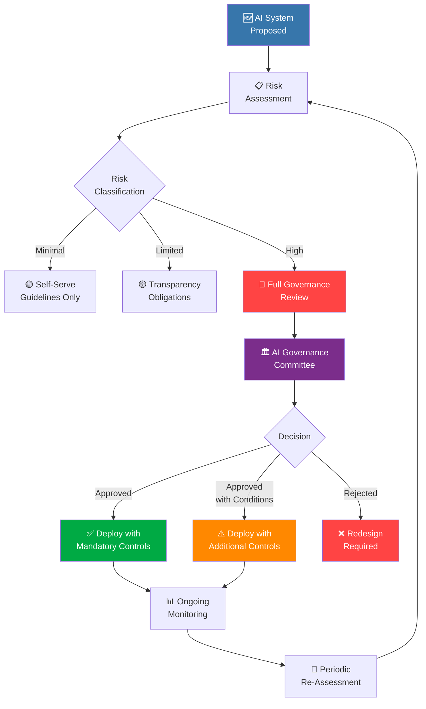
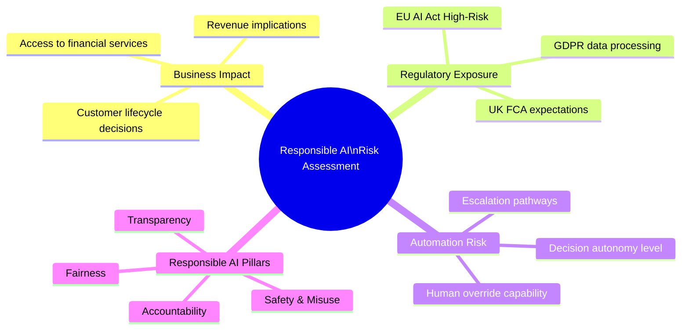
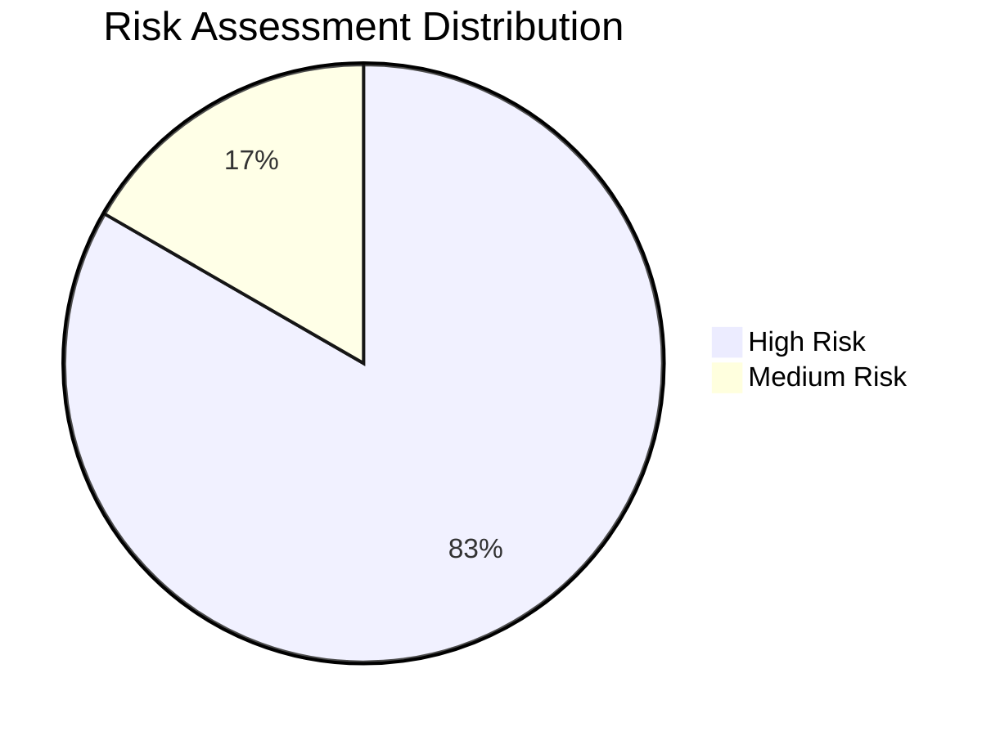
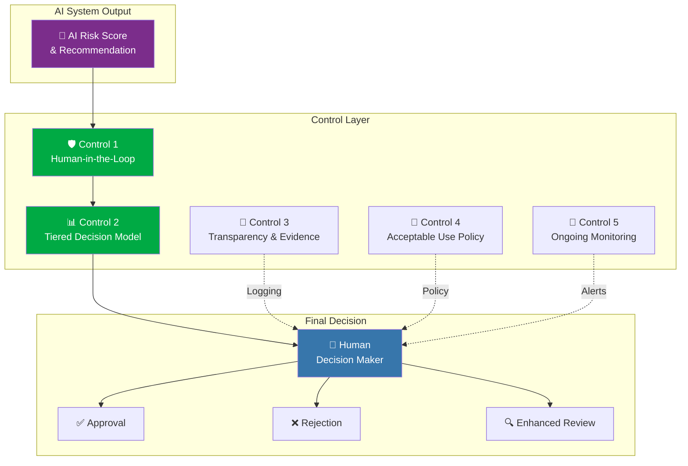
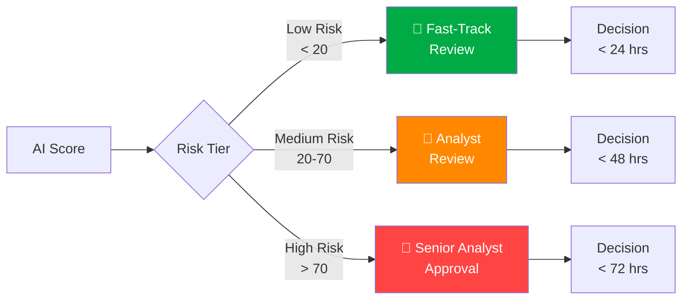
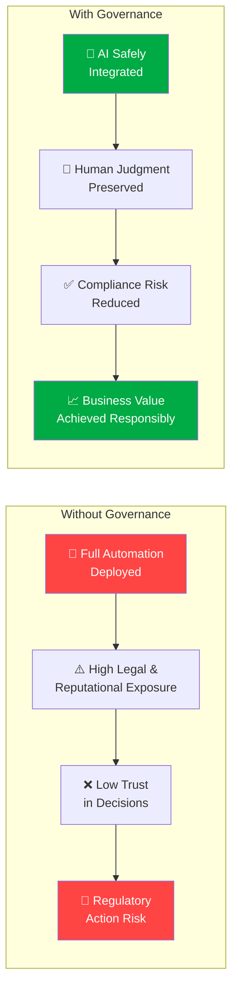

<div align="center">

# 🏛️ Responsible AI Governance — High-Risk AI System Controls

[](https://artificialintelligenceact.eu/)
[](https://www.gov.uk/government/publications/ai-regulation-a-pro-innovation-approach)
[]()
[]()
[](LICENSE)

</div>

---

## 📌 Project Overview

I designed and implemented a **Responsible AI Governance Framework** for a High-Risk AI system operating in a regulated financial services environment within the **UK and EU**.

The use case — AI-assisted **customer onboarding and fraud risk scoring** — is explicitly classified as **High Risk under the EU AI Act** (Annex III §5(b)) because it directly affects individuals' access to financial services. Without governance, deploying this system would expose the organisation to severe legal, ethical, and reputational risk.

This project demonstrates how to translate abstract Responsible AI principles into **practical, enforceable governance mechanisms** — moving from policy to control to audit trail.

> **The core problem I solved:** The business wanted AI to speed up onboarding and reduce fraud losses. I designed the governance framework that made deployment possible while protecting customers, the organisation, and regulatory compliance.

---

## 🎯 Business Context & Problem Statement

The organisation faced three critical challenges that drove the AI proposal:

| Challenge | Business Impact |
|---|---|
| **Manual reviews are slow and inconsistent** | Onboarding takes 5–7 days; customer drop-off rates increasing |
| **Fraud losses continue despite existing controls** | £2.3M in fraud losses last fiscal year; reactive detection only |
| **Compliance teams cannot scale** | Headcount-constrained; review quality degrades under volume pressure |

The business proposed an AI solution to improve efficiency — but without governance, this would introduce **severe legal, ethical, and reputational risks** that would far outweigh any operational gains.

---

## 🤖 Proposed AI Use Case

The proposed AI system would score new customer onboarding applications and recommend one of three outcomes:



### AI Inputs

| Data Category | Examples |
|---|---|
| Customer application data | Name, address, ID documents, employment status |
| Transactional signals | Account funding patterns, transaction velocity |
| Device and behavioural metadata | Device fingerprint, session behaviour, geolocation |
| Historical fraud patterns | Known fraud vectors, mule account indicators |

### Initial Business Goals

- Reduce onboarding time by ~60%
- Automate low-risk approvals and high-risk rejections
- Escalate only borderline cases to human analysts

⚠️ **This proposal triggered a mandatory Responsible AI governance review** due to its impact on individuals' access to financial services — a High-Risk classification under the EU AI Act.

---

## 🧭 AI Governance Operating Model

All AI systems must enter a formal governance pipeline before deployment. The operating model enforces a single principle:

> **No AI system progresses without explicit risk assessment, ownership, and approval.**



The operating model enforces:

- **Risk-based classification** — proportionate controls based on actual impact
- **Committee oversight** — cross-functional review for High-Risk systems
- **Go / No-Go decisions** — explicit approval gates before deployment
- **Control enforcement** — mandatory controls proportional to risk tier

---

## 📝 Responsible AI Risk Assessment

A Responsible AI Risk Assessment was performed before any deployment decision. The assessment covered six risk dimensions aligned with EU AI Act requirements and industry-standard Responsible AI pillars.

### Assessment Scope



### Risk Assessment Findings

| Risk Dimension | Rating | Assessment |
|---|---|---|
| **Business Impact** | 🔴 High | Decisions directly affect individuals' access to financial services |
| **Data & Privacy** | 🔴 High | Sensitive personal and financial data processed; special category data possible |
| **Fairness** | 🔴 High | Historical data may encode demographic bias; disparate impact risk |
| **Accountability** | 🟡 Medium | Owners identified; escalation paths defined; liability assignment clear |
| **Transparency** | 🔴 High | Model decisions not fully explainable; black-box scoring unacceptable |
| **Safety & Misuse** | 🔴 High | Risk of automation bias; over-reliance on AI recommendations |

### Overall Risk Classification



**Classification: 🔴 HIGH RISK**

The system falls within **EU AI Act Annex III §5(b)** — AI systems used to evaluate creditworthiness or establish credit scores of natural persons. Full compliance with Articles 9–15 is mandatory.

→ Full assessment methodology: [`docs/risk-assessment.md`](docs/risk-assessment.md)

---

## 🏛️ Governance Committee Review

The completed risk assessment was presented to a cross-functional AI Governance Committee for review and decision.

### Committee Composition

| Role | Responsibility |
|---|---|
| **Head of Digital** (Business Owner) | Accountable for business outcomes and risk acceptance |
| **CISO / Head of Security** | Assesses security, data protection, and technical controls |
| **Head of GRC** | Evaluates regulatory compliance and governance adequacy |
| **Legal & Compliance** | Advises on legal obligations and liability exposure |

### Committee Evaluation Criteria

The committee evaluated the proposal against four key questions:

1. **Who is affected by decisions?** — Natural persons seeking financial services
2. **What is the regulatory exposure?** — EU AI Act High Risk (Annex III §5(b)); UK FCA Consumer Duty
3. **What are the risks by Responsible AI pillar?** — Fairness and Transparency rated High
4. **What control options exist, and what is the residual risk?** — Controls available; residual risk acceptable with conditions

### Decision Outcome

| Decision | Status |
|---|---|
| **Verdict** | ✅ Approved with Conditions |
| **Key Condition** | Full automation is **explicitly not permitted** |
| **Rationale** | Human-in-the-loop controls required to manage fairness and accountability risks |

---

## 🔐 Enforced Responsible AI Controls

The following five mandatory controls were imposed as conditions of approval. These controls translate Responsible AI principles into enforceable operational requirements.

### Control Architecture



---

### Control 1: Mandatory Human-in-the-Loop

The AI system outputs are **advisory only**. No automated decision is permitted.

| Requirement | Implementation |
|---|---|
| AI outputs are recommendations, not decisions | UI clearly labels outputs as "AI Recommendation" |
| All rejections require human review before action | System blocks rejection actions without analyst sign-off |
| Final accountability remains with human decision-makers | Decision audit trail captures human approver identity |

**Regulatory basis:** EU AI Act Article 14 — Human oversight must be meaningful, not nominal.

---

### Control 2: Tiered Decision Model

AI recommendations are routed to appropriate human review tiers based on risk level.



| Risk Tier | Threshold | Review Level | SLA |
|---|---|---|---|
| 🟢 Low Risk | Score < 20 | Fast-track review | 24 hours |
| 🟡 Medium Risk | Score 20–70 | Analyst review | 48 hours |
| 🔴 High Risk | Score > 70 | Senior analyst approval | 72 hours |

---

### Control 3: Transparency & Evidence Logging

Every AI recommendation and human decision must be logged with sufficient detail for audit, complaint handling, and regulatory inquiry.

| Data Element | Retention Period |
|---|---|
| Input data used for scoring | 7 years |
| AI recommendation and confidence score | 7 years |
| Human override decisions with rationale | 7 years |
| Final outcome and timestamp | 7 years |

**Evidence supports:**
- Internal audit reviews
- Customer complaint investigations
- Regulatory inquiries and examinations

---

### Control 4: Acceptable Use Policy Enforcement

All staff interacting with the AI system must acknowledge and comply with the Acceptable Use Policy.

| Policy Requirement | Enforcement |
|---|---|
| AI cannot be the sole decision-maker | System architecture enforces human approval step |
| Staff must document rationale when following AI advice | Free-text rationale field mandatory for approval actions |
| Overrides are encouraged when professional judgment disagrees | Override rate tracked; no penalty for justified overrides |

→ Full policy document: [`policies/acceptable-use-policy.md`](policies/acceptable-use-policy.md)

---

### Control 5: Ongoing Monitoring & Re-Assessment

The AI system is subject to continuous monitoring and periodic re-assessment to detect drift, bias emergence, and control effectiveness.

| Monitoring Activity | Frequency |
|---|---|
| Fairness testing (demographic parity, equalised odds) | Quarterly |
| Model drift detection | Monthly |
| Override rate analysis | Monthly |
| Full governance re-assessment | Annually, or triggered by: |

**Mandatory re-assessment triggers:**
- Model architecture changes
- Training data source changes
- Automation level changes (any reduction in human oversight)
- Regulatory guidance updates
- Material fairness metric deviation

---

## ✔️ Final Outcome — Governance Impact

The governance framework transformed a high-risk proposal into a compliant, auditable deployment.



| Dimension | Without Governance | With Governance |
|---|---|---|
| **Automation** | Full automation deployed | AI advisory with human oversight |
| **Legal Exposure** | High — EU AI Act non-compliance | Reduced — Articles 9–15 addressed |
| **Reputational Risk** | High — fairness incidents likely | Managed — bias monitoring active |
| **Customer Trust** | Low — opaque automated decisions | Higher — human accountability preserved |
| **Business Value** | Short-term gains, long-term liability | Sustainable value, responsible deployment |

---

## 📁 Repository Structure

```
Responsible-AI-Governance/
├── README.md                              ← You are here
├── docs/
│   ├── risk-assessment.md                 ← Full Responsible AI risk assessment methodology
│   └── control-implementation.md          ← Detailed control specifications
├── policies/
│   └── acceptable-use-policy.md           ← AI Acceptable Use Policy template
├── screenshots/
│   └── README.md                          ← Screenshot reference guide
└── LICENSE
```

---

## 🧠 Skills Demonstrated

- **AI Governance** — Designing governance operating models that translate policy into enforceable controls
- **EU AI Act** — Applying High-Risk classification criteria and implementing Articles 9–15 obligations
- **Responsible AI** — Operationalising fairness, accountability, transparency, and safety principles
- **Risk Assessment** — Structured risk evaluation across business, regulatory, and ethical dimensions
- **Control Design** — Creating proportionate, auditable controls that enable rather than block deployment
- **Stakeholder Management** — Facilitating cross-functional governance committee decisions
- **Technical Writing** — Producing audit-ready documentation from governance artifacts

---

## 📚 Frameworks & References

| Resource | Link |
|---|---|
| EU AI Act (Official Text) | [EUR-Lex 2024/1689](https://eur-lex.europa.eu/legal-content/EN/TXT/?uri=CELEX:32024R1689) |
| EU AI Act Annex III — High-Risk Systems | [EUR-Lex Annex III](https://eur-lex.europa.eu/legal-content/EN/TXT/?uri=CELEX:32024R1689#anx_III) |
| NIST AI Risk Management Framework 1.0 | [airmf.nist.gov](https://airmf.nist.gov/) |
| UK AI Regulation White Paper | [gov.uk](https://www.gov.uk/government/publications/ai-regulation-a-pro-innovation-approach) |
| FCA Consumer Duty | [fca.org.uk](https://www.fca.org.uk/firms/consumer-duty) |

---

<div align="center">

**franciscovfonseca** · [GitHub](https://github.com/franciscovfonseca) · [LinkedIn](https://linkedin.com/in/franciscovfonseca)

[](LICENSE)

</div>
